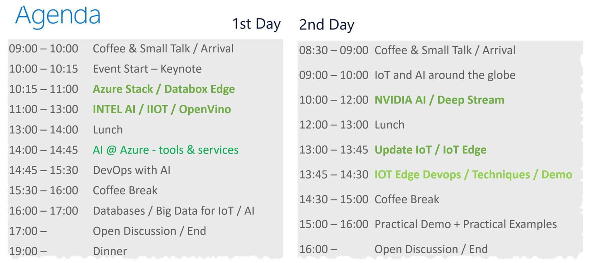

# 
 Microsoft IOT and AI Summit 
 # 
## 
 9/11 - 9/12 2019 Office Lehel 
 ##
 
Thank you all for your attendance. It was a real pleasure to have you on board. As promised here are the information from the speakers as they arived. and of course I try to setup a few links, so you have everything in one place. Unfortunately some information are __NDA__ only and cannot be shared in a public place. So please contact me directly: Axel.Dittmann@Microsoft.com

But first the agenda:

### Slideshare:
[Intel's presentation on AI](https://github.com/DittmannAxel/AI_IOT_Summit_Sept19/blob/master/IntelAIVisionupdateMicrosoftAIuIOTSummit2019v09.pdf), Contact: Stefani Eisele: <Stefani.Eisele@Intel.com> and Julian Fischer: <Julian.Fischer@intel.com>    
[NVIDIA's presentation on AI](https://github.com/DittmannAxel/AI_IOT_Summit_Sept19/blob/master/NVIDIA_Azure_IoT_v1.pdf), Contact: Dr. Ulrich Knechtel: <uknechtel@nvidia.com>  
[Databases](https://github.com/DittmannAxel/AI_IOT_Summit_Sept19/blob/master/AzureSQLDW.pdf). Contact: Ruediger Schickhaus: <Ruediger.Schickhaus@Microsoft.com> 
[IOT and AI around the globe](https://github.com/DittmannAxel/AI_IOT_Summit_Sept19/blob/master/IOTuAIaroundtheglobe.pdf), Contact: Dr. Lydia Nemec - Twitter: @LydiaNemec
 
AI  tools & services on Azure, Contact: Dr. Stefan Cronjaeger <Stefan.Cronjaeger@Microsoft.com> 
[IntelligentEdge_AzureStack](https://github.com/DittmannAxel/AI_IOT_Summit_Sept19/blob/master/AIUIoT-Event_Azure-Edge-customer-ready.pdf), Contact: Alexander Ortha <Alexander.Ortha@Microsoft.com> - Twitter: @AlexanderOrtha
 
Azure DevOps with AI, Contact: Dr. Mohammad Zamaninasab: <Mohammad.Zamaninasab@microsoft.com>
 
Industrial Use Case, Contact: Mirko Zipfel <Mirko.Zipfel@Zeiss.com>, Axel Dittmann <Axel.Dittmann@Microsoft.com> - Twitter: @DittmannAxel  
Practical Demo & IOT Update, Contact: Stepan Bechynsky <Stepan.Bechynsky@Microsoft.com>, Vitaliy Slepakov <Vitaliy.Slepakov@Microsoft.com> 
### Additional Information ###
The paper which Lydia was talking about Uli's session: [Benefits from using mixed precision computations in the ELPA-AEO and ESSEX-II eigensolver projects](https://link.springer.com/article/10.1007/s13160-019-00360-8)  

# stay tuned, will update, once I get the all the info #

